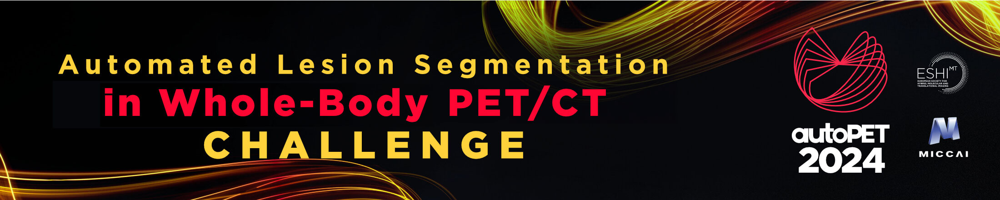

# autoPETIII challenge
Repository for code associated with autoPETIII machine learning challenge: <br/> 
[autopet-iii.grand-challenge.org](https://autopet-iii.grand-challenge.org/autopet-iii/) 

If you use the data associated to this challenge, please cite: <br/>
<a href="https://doi.org/10.7937/gkr0-xv29"></a>

```
Gatidis S, Kuestner T. A whole-body FDG-PET/CT dataset with manually annotated tumor lesions (FDG-PET-CT-Lesions) 
[Dataset]. The Cancer Imaging Archive, 2022. DOI: 10.7937/gkr0-xv29
```

and
<br/>
COMMING SOON

```
COMING SOON
```

## nnunet-baseline
Baseline model for lesion segmentation: The nnUNet framework (https://github.com/MIC-DKFZ/nnUNet) 
was used for training the baseline model using the 3D fullres configuration with 16 GB of VRAM. PET (SUV) and resampled CT volumes were used 
as model input. The model was trained for 250k steps; the initial learning rate to 1e-4. Training was performed with 
all samples. Inference runs without test-time augmentation because of the challenge time limit of 5 minutes.

## datacentric-baseline
Baseline model for lesion segmentation in award category 2: This model is based on the provided 
[datacentric challenge framework](https://github.com/ClinicalDataScience/datacentric-challenge/tree/main). 
Input patches were of size (128, 160, 112), batch size was set to 4, 2 A100 GPUS were used, learning rate 1e-4 using 
SGD, trained for roughly 250k steps on all cases. During inference the model makes use of a dynamic test-time 
augmentation because of the time limit of 5 minutes. It also clips every mask values where the suv is smaller than one. 

## evaluation-metrics
Evaluation code for the autoPETIII challenge according to [here](https://autopet-iii.grand-challenge.org/evaluation-and-ranking/)

## References
Challenge: [](https://doi.org/10.5281/zenodo.10990932)<br/>
FDG Database: <a href="https://doi.org/10.7937/gkr0-xv29"></a> <br/>
PSMA Database: COMMING SOON


